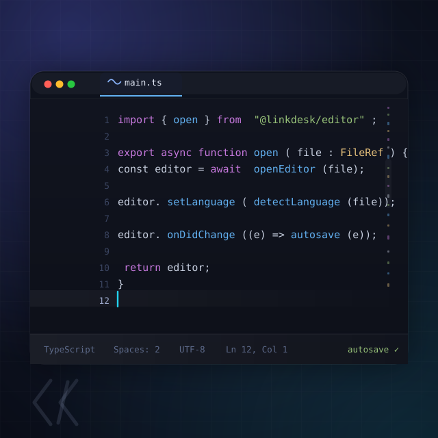

# 编辑器（editor）



> LinkDesk 官方内置 · `core: true` · Monaco 引擎
> **理念一句话：** 双击文件，它就开。LinkDesk 是空壳——文件树、搜索、终端都只是导航；真正「坐下来写」的地方，是编辑器这一张桌。它不替你做决定，只把 Monaco 的全部功力摆在一扇窗里：语法高亮、智能提示、括号对着色、平滑滚动……你想怎么编辑，它就怎么配合。

## 它能做什么

- **双击即开** —— 在文件树 / 资源管理器里双击任意文件，以一个新标签页打开；同一文件再次打开会聚焦已有标签（`filePath` 单通道身份）。
- **45 种文件格式**开箱即认 —— TypeScript / Python / Rust / C / C++ / Go / Java / JSON / Markdown / HTML / CSS / SQL / Lua / PHP / Ruby / Shell / Diff……（完整清单见文末）。
- **语言自动识别** —— 打开时按路径自动匹配语言；也可随时切换。
- **左右 Diff 对比** —— 把两个文件的内容并排对比；改动行 / 增删高亮一目了然。
- **智能编辑** —— 快速建议、函数参数提示、括号自动闭合、括号对着色、缩进引导线、选区同词高亮、HTML/XML 标签同步改名。
- **跟壳的主题走** —— 你换外观主题，编辑器配色同步切换（theme-sync），不会在深色壳里亮出一块刺眼的白。
- **热退出恢复（Hot Exit）** —— 没保存的修改按秒落盘备份；池进程意外退出后再打开，内容与「未保存」脏标记一起回来，编辑不因崩溃蒸发。
- **面包屑 + 右键菜单 + 状态栏** —— 顶上面包屑导航文件路径，右键有常用操作，底部状态栏显示语言 / 行列 / 编码等。
- **贴心显示** —— 行号（含相对 / 区间模式）、代码缩略图、平滑滚动、`Ctrl + 滚轮` 缩放、自动换行、空白符渲染、多种光标样式与闪烁方式。

## 上手

1. 在**文件树**里找到文件 → **双击**，就在标签页里打开编辑了。
2. 直接打字即可；`文件` 相关行为（自动保存）去 **设置 → 编辑器** 里调。
3. 想对比两个文件 → 命令面板执行 **比较文件**；拖动场景下两条文件路径以 `|||` 相连也会自动进入对比视图。
4. 误关了标签页 → 命令面板执行 **重新打开已关闭的编辑器**。

## 设置一览（设置 → 编辑器）

| 分组 | 设置（节选） | 默认 |
|---|---|---|
| 文件 | `files.autoSave` —— off / afterDelay（空闲 1 秒自动存）/ onFocusChange（切走标签自动存） | `off` |
| 字体 | `editor.fontSize` / `editor.fontFamily` / `editor.fontWeight` / `editor.lineHeight` | 14 / Consolas / normal / 0(自动) |
| 缩进 | `editor.tabSize` / `editor.insertSpaces` / `editor.detectIndentation` | 4 / 空格 / 自动检测 |
| 显示 | `editor.wordWrap` / `editor.lineNumbers` / `editor.minimap.enabled` / `editor.renderWhitespace` / `editor.smoothScrolling` | off / on / 开 / selection / 开 |
| 光标与滚动 | `editor.cursorStyle` / `editor.cursorBlinking` / `editor.mouseWheelZoom` | line / blink / 开 |
| 编辑 | `editor.autoClosingBrackets` / `editor.bracketPairColorization` / `editor.guides.indentation` / `editor.linkedEditing` / `editor.occurrencesHighlight` / `editor.selectionHighlight` | 全开 |
| 智能提示 | `editor.parameterHints.enabled` / `editor.quickSuggestions` / `editor.suggest.showWords` / `editor.suggest.showSnippets` | 开 |

## 命令

| 命令 | 说明 |
|---|---|
| `editor.reopenClosedEditor` | 重新打开刚关闭的编辑器标签 |
| `editor.compareFiles` | 比较文件（左右 Diff） |

## 支持的文件格式（45）

`ts` `tsx` `js` `jsx` `mjs` `cjs` · `json` `jsonc` · `html` `htm` `css` `scss` `less` · `md` `mdx` · `py` `rs` `c` `h` `cpp` `hpp` `go` `java` · `xml` `svg` `yaml` `yml` `toml` · `sh` `bash` `bat` `cmd` · `sql` `lua` `php` `rb` `swift` `kt` `dart` · `diff` `patch` · `ini` `cfg` `txt` `log`

## 小提示

- **手动 vs 自动保存**：默认 `files.autoSave = off`（手动保存）；Hot Exit 只是「崩溃兜底」，不等于自动保存。想省事可把 `files.autoSave` 设成 `afterDelay` 或 `onFocusChange`。
- 编辑器的整体观感（背景 / 文字色 / accent）**不属于它自己**——那是壳主题在管。它只负责代码这一亩三分地。

## 结构（给维护者）

```
src/
├─ index.tsx              # 插件入口：无文件→引导语；含 ||| → DiffEditor；否则 EditorTab
├─ components/            # EditorTab / EditorBreadcrumb / EditorContextMenu / EditorStatusBar
├─ views/                 # EditorView（Monaco 宿主）/ DiffEditor（左右对比）
├─ services/              # monaco-bootstrap / theme-sync / language-map / hot-exit / ts-intelligence / lsp-bridge / navigation-bridge / EditorModel
├─ styles/editor.css
└─ i18n/en.json
```
